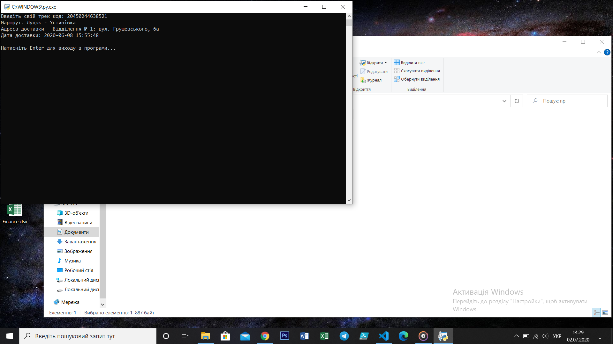

# novaPoshta
Парсинг данних по трекеру, з термінала python

**Інсталяція**  
Завантажити та встановити [python](https://www.python.org/)  
Встановити бібліотеку **bs4** командою **pip install bs4**    
Встановити бібліотеку **requests** командою **pip install requests**  

